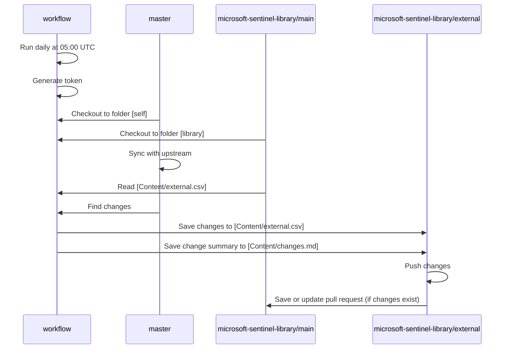
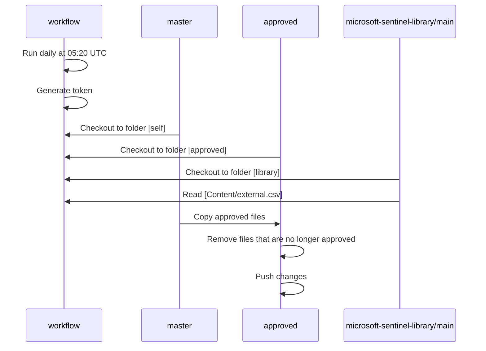

# Microsoft Sentinel and Microsoft Defender XDR

- [Branch: master](#branch-master)
  - [Branch protection for master](#branch-protection-for-master)
- [Branch: approved](#branch-approved)
  - [Branch protection for approved](#branch-protection-for-approved)
  - [Workflow: Publish Content Changes](#workflow-publish-content-changes)
  - [Workflow: Update Approved Content](#workflow-update-approved-content)

## Branch: master

This fork of the [Azure-Sentinel](https://github.com/Azure/Azure-Sentinel) repository exist for the following reasons:

- Allow us to contribute changes and new content to the community.
- Use automation to process community content.
- Approve content for use by the
  [Innofactor MDR Service](https://github.com/innofactororg/innofactor-mdr).

Only the `master` branch has been forked. No changes will be made by us to this branch, but it will be kept up to date with the upstream repository on a daily basis.

### Branch protection for master

The `default` branch is protected by the following rules:

- **Bypass list**:
  - Repository admin (Role)
- **Restrict deletions**
- **Require linear history**
- **Require a pull request before merging**:
  - Required approvals: 1
  - Dismiss stale pull request approvals when new commits are pushed
  - Require approval of the most recent reviewable push
  - Require conversation resolution before merging
- **Require status checks to pass**
- **Block force pushes**

## Branch: approved

This branch exist to store automation workflows and approved content files.

The approval of content depend on the following components:

- The `approved` branch. Stores the automation workflows and the approved files.
- The [Content/external.csv](https://github.com/innofactororg/microsoft-sentinel-library/blob/main/Content/external.csv) file. This is the review file with content that is approved, ignored or requires a review.
- The [Publish Content Changes](#workflow-publish-content-changes) workflow. This workflow ensures that changes are published as a pull request for review in the [microsoft-sentinel-library](https://github.com/innofactororg/microsoft-sentinel-library) repository.
- The [Update Approved Content](#workflow-update-approved-content) workflow. This workflow ensures that approved files exist in the `approved` branch.

To keep the size as small as possible, the `approved` branch was created as orphan using the following commands:

```bash
git clone --filter=tree:0 --no-checkout https://github.com/innofactororg/microsoft-sentinel.git
cd microsoft-sentinel
git switch --orphan approved
git commit --allow-empty -m "Initial commit on orphan branch"
git push origin approved
git push --set-upstream origin approved
```

### Branch protection for approved

The `approved` branch is protected by the following rules:

- Bypass list:
  - Repository admin (Role)
  - MDR Sentinel Write (App)
- **Restrict creations**
- **Restrict updates**
- **Restrict deletions**
- **Require linear history**
- **Require a pull request before merging**:
  - Required approvals: 1
  - Dismiss stale pull request approvals when new commits are pushed
  - Require approval of the most recent reviewable push
  - Require conversation resolution before merging
- **Require status checks to pass**
- **Block force pushes**

### Workflow: Publish Content Changes

The [Publish-ContentChanges.yml](.github\workflows\Publish-ContentChanges.yml) workflow, will run daily at 05:00 UTC and can be triggered manually.

The purpose is to publish content changes to [Content/external.csv](https://github.com/innofactororg/microsoft-sentinel-library/blob/main/Content/external.csv) by creating a pull request. The changes are listed in [Content/changes.md](https://github.com/innofactororg/microsoft-sentinel-library/blob/main/Content/changes.md).

The sequence of actions performed by the workflow is as follows:

- **Participants**:
  - workflow
  - master
  - microsoft-sentinel-library/main
  - microsoft-sentinel-library/external

- **Sequence of actions**:
  - Workflow runs daily at 05:00 UTC
  - Workflow generates token
  - Master checks out to folder 'self'
  - Main from microsoft-sentinel-library checks out to folder 'library'
  - Master syncs with upstream
  - Main from microsoft-sentinel-library reads Content/external.csv
  - Master finds changes
  - Workflow saves changes to Content/external.csv in external
  - Workflow saves change summary to Content/changes.md in external
  - External pushes changes
  - External saves or updates pull request to main in microsoft-sentinel-library (if changes exist)



### Workflow: Update Approved Content

The [Update-ApprovedContent.yml](.github/workflows/Update-ApprovedContent.yml) workflow will run daily at 05:20 UTC and can be triggered manually.

The purpose is to update the `approved` branch and populate it with the approved content by using the data in the [Content/external.csv](https://github.com/innofactororg/microsoft-sentinel-library/blob/main/Content/external.csv)  file.

The sequence of actions performed by the workflow is as follows:

- **Participants**:
  - workflow
  - master
  - approved
  - microsoft-sentinel-library/main

- **Sequence of actions**:
  - Workflow runs daily at 05:20 UTC
  - Workflow generates token
  - Master checks out to folder 'self'
  - Approved checks out to folder 'approved'
  - Main from microsoft-sentinel-library checks out to folder 'library'
  - Main from microsoft-sentinel-library reads Content/external.csv
  - Master copies approved files to approved
  - Approved removes files that are no longer approved
  - Approved pushes changes


